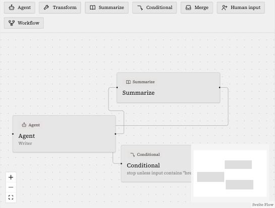

<div align="center">

# Rivulets

**A local-first, Slack-like workspace where humans and teams of AI agents work side by side.**

[](https://github.com/jwilson411/Rivulets/actions/workflows/ci.yml)
[](./LICENSE)

</div>

<p align="center">
  
</p>

## What is Rivulets?

Rivulets is a chat-native workspace, in the shape of Slack, where the people in a channel aren't the only ones paying attention. You create channels and populate them with **teams of AI agents** — each with its own instructions, model, and area of expertise. **Assistant** is the orchestrator in every channel: it answers first, asks clarifying questions, and unlocks the rest of the team when the request is clear. Specialists then jump in when something is relevant to them. `@mentions` still work when you want to be explicit.

Under the hood, every agent, tool, and MCP server you configure maps directly onto [Agno's AgentOS](https://github.com/agno-agi/agno) — Rivulets is a thin, opinionated UI and dispatch layer over a production-grade agent runtime, not a reimplementation of one. A **channel dispatcher** decides who should respond to each message: first against deterministic routing rules generated when an agent is created (fast, no LLM call), and only when nothing matches does it escalate to a lightweight LLM router. Agents can **hand off** to one another mid-conversation, and platform-level guardrails cap turn counts and detect cycles so two agents can't loop forever.

Conversations behave like the small, natural flows the name is borrowed from: a channel is the wider stream, and every thread that branches off it is a **rivulet** — its own quiet current, splitting off to run its course and (often) rejoin later.

**Rivulets is fully decentralized.** There is no Rivulets server, hosted service, or account to sign up for. You install it locally, it runs as a single process on your machine, and you access it through a browser pointed at `localhost`. Your LLM provider API keys stay on that machine, in your OS keychain — they're never synced anywhere. If you want the same workspace on more than one machine, they find each other and sync directly, peer-to-peer, using a workspace key that also doubles as your login credential.

## Features

### Chat-native multi-agent workspace

- **Channels & teams** — organize agents into teams, assign a team to a channel, and every message in that channel is visible to the whole team.
- **Orchestrated dispatch** — Assistant is always in the channel and holds the thread until it (or you) engages the team. After that, specialists respond based on relevance (keyword/regex rules, semantic matching, or "always respond"). Every agent sees the rivulet's chat history, not just the latest turn.
- **Agent handoffs** — an agent can hand a conversation to a teammate mid-thread, with the context carried over and the handoff itself shown as a distinct event, not just another message.
- **Threaded rivulets** — every conversation that branches off a channel is its own persistent thread with full history and context management.
- **Loop guards** — turn-count caps and cycle detection stop two agents from volleying a conversation back and forth forever.
- **File attachments & vision** — attach files to any message; agents can read and act on them, and attached images are shown to agents directly rather than just described in text.

### Automation: workflows

- **Saved, reusable automations** — a workflow is a named, node-based automation a channel or agent can trigger, chaining agents together with utility steps (deterministic transforms, ad hoc summarization, conditional branches, and merges).
- **Visual canvas** — a drag-and-drop node editor: place nodes from a palette, wire up connections, and watch a run animate over the canvas node by node as it executes.
- **Multiple ways to trigger a run** — a `/workflow-name <input>` slash command typed in a channel, an agent calling a `run_workflow` tool mid-conversation, an incoming webhook, or a schedule.
- **Retries and visible step output** — each node supports a configurable retry policy, and each execution posts a visible step indicator into the thread so a run reads like an auditable trail rather than a black box.

<p align="center">
  
</p>

### Tools & extensibility

- **MCP servers & custom tools** — connect external MCP servers or write your own tools in Python; agents discover and use them like any built-in capability.
- **Built-in tools out of the box** — including sandboxed code execution, web search, HTTP requests, file/filesystem access, database queries, knowledge-base lookup, and workflow/schedule/channel management actions.
- **Per-tool permission scope** — fine-grained control over which tools an agent can use and what they're allowed to touch.

### Knowledge & governance

- **Knowledge bases (RAG)** — give agents a knowledge base of ingested documents to ground answers in your own data, searchable mid-conversation via a `search_knowledge_base` tool.
- **Unified approval queue** — one inbox for anything that needs a human's OK before it happens: an agent-created schedule, a spend budget that's been exceeded, or an agent blocked from using a sensitive tool unattended.
- **Evals** — build regression-test suites for agents and workflows (fixed inputs judged against an expected outcome) so a behavior change shows up as a failing case instead of a human happening to notice a bad reply.
- **Usage dashboard & spend budgets** — token consumption and cost aggregated by agent and model, with budgets that require approval before a threshold is crossed.
- **Runs** — one end-to-end, timed timeline per human message, slash command, or scheduled workflow fire, linking dispatch decisions, agent replies, and workflow steps together.

### Peer-to-peer sync

- **No central server, ever** — multiple machines on the same workspace key sync channels, agents, teams, and files directly with each other over an encrypted mesh.
- **Coordinator election** — election primitive shipped (capability scoring, bully-style claim, automatic failover). Singleton consumers (a scheduled workflow firing once, budget aggregation, trace retention) are **not wired yet**; duplicate scheduled fires across peers are avoided today by keeping schedules local/unsynced, not by election.

### Local-first security posture

- The web UI binds to `127.0.0.1` by default, provider API keys live in your OS keychain, and code execution tools run sandboxed — on macOS and native Linux installs. The Code Execution tool isn't available on Windows or in the default Docker image (no sandbox backend on Windows yet; firejail isn't installed in the image — see [`docs/security.md`](docs/security.md)); it fails closed on those platforms rather than running unsandboxed.
- **Multi-human workspaces via scoped invites** — a second person can join without ever seeing the recovery phrase; invite-based sessions are gated out of sensitive surfaces (provider credentials, sync control, settings) and never gain peer-to-peer mesh membership.

## Installation

Rivulets ships as a single server process that serves both the API and the web UI. Pick whichever install path fits:

### Quick install (macOS / Linux)

```bash
curl -fsSL https://raw.githubusercontent.com/jwilson411/Rivulets/v0.6.0/scripts/install.sh | sh
rivulets
```

The script is fetched from a tagged release rather than `main`, so a compromised commit to the default branch can't retroactively alter what a fresh `curl | sh` run downloads and verifies. This downloads the right binary for your OS/architecture from [GitHub Releases](https://github.com/jwilson411/Rivulets/releases), verifies its SHA-256 checksum and its Sigstore signature (keyless, tied to the GitHub Actions workflow that built it — a checksum alone can't prove that, since it's published from the same release as the binary it's checking), and installs it to `~/.local/bin`. No Python or Node.js required on your machine — everything is bundled.

[cosign](https://docs.sigstore.dev/cosign/system_config/installation/) is required for that signature check and the script refuses to install without it; pass `--insecure-checksum-only` (`curl ... | sh -s -- --insecure-checksum-only`) to accept checksum-only verification instead.

**Windows:** the install script is POSIX-only. Download `rivulets-windows-amd64.exe` directly from the [releases page](https://github.com/jwilson411/Rivulets/releases) and run it. The Code Execution built-in tool is unavailable on Windows — there's no sandbox backend wired up yet (see [`docs/security.md`](docs/security.md)) — everything else works.

**Intel Mac:** no native binary yet (only Apple Silicon `darwin-arm64` is built) — use Docker or build from source below.

### Docker

```bash
docker compose up -d
```

or without Compose:

```bash
docker build -t rivulets:local .
docker run -d --name rivulets \
  -p 127.0.0.1:8484:8484 \
  -v rivulets-data:/data \
  rivulets:local
```

Workspace data (the SQLite database, uploaded files, keys, logs) lives in `/data` inside the container — always mount a volume there, or a container restart starts a fresh workspace. The port is published loopback-only (`127.0.0.1:8484`) by default, matching a native install's security posture: reachable from this machine only. Change that to `8484:8484` only if you deliberately want it reachable from your LAN — Rivulets has no additional network auth beyond the workspace key.

**If you do publish it beyond loopback**, set both `RIVULETS_REQUIRE_BOOTSTRAP_TOKEN=1` and `RIVULETS_BOOTSTRAP_TOKEN` before the first login: the container binds `0.0.0.0` internally regardless of the host port mapping (see `main.py`), so the app can't tell a loopback-only publish from a LAN one on its own — without the token, anyone reaching the container before you've logged in for the first time could otherwise claim the workspace with their own recovery phrase. With both set, first login must supply the token (as `bootstrap_token` in the `POST /auth/login` body) to create the workspace; every login afterward is unaffected.

```bash
export RIVULETS_BOOTSTRAP_TOKEN=$(openssl rand -hex 32)
echo "Bootstrap token (needed for first login only): $RIVULETS_BOOTSTRAP_TOKEN"

docker run -d --name rivulets \
  -p 8484:8484 \
  -e RIVULETS_REQUIRE_BOOTSTRAP_TOKEN=1 \
  -e RIVULETS_BOOTSTRAP_TOKEN \
  -v rivulets-data:/data \
  rivulets:local
```

**Code Execution tool:** unavailable in this image — it doesn't ship firejail, so the tool reports itself unavailable and fails closed rather than running agent code unsandboxed. See [`docs/security.md`](docs/security.md#code-execution-under-docker) for why, and the opt-in profile if you need it anyway.

### Build from source

**Prerequisites:** Python 3.11+ ([uv](https://github.com/astral-sh/uv) for dependency management), Node.js 20+ / npm.

```bash
git clone https://github.com/jwilson411/Rivulets.git
cd Rivulets
uv sync --project server --dev
cd ui && npm install && npm run build && cd ..

# app.py looks for the built UI at server/src/rivulets/static (see
# rivulets.app._static_dir) — `npm run build` alone doesn't put it there.
mkdir -p server/src/rivulets/static
cp -r ui/build/* server/src/rivulets/static/

uv run --project server rivulets
```

Or run it in hot-reload dev mode across two terminals, without the build/copy step above — the Vite dev server serves the UI directly and proxies API calls to the App Server:

```bash
# Terminal 1 — App Server (API)
uv run --project server uvicorn rivulets.app:app --reload --port 8484

# Terminal 2 — SvelteKit dev server
cd ui && npm run dev -- --port 5173
```

In dev mode, open `http://localhost:5173`. Everywhere else (installed binary, Docker), the App Server serves the UI itself — open `http://localhost:8484`.

## First run

However you installed it, open the app in your browser and enter any 12-word phrase as your **workspace recovery phrase** — a valid phrase you haven't used before creates a fresh workspace on the spot; entering one you've used before logs back into that same workspace. Write it down: it's also what lets a second machine join the same workspace later, and there's no password-reset flow if you lose it.

From there: add an LLM provider under **Providers**, create an **Agent** or two, group them into a **Team**, create a **Channel**, and assign the team to it. Post a message and watch the dispatcher route it.

## Configuration

All configuration is via `RIVULETS_*` environment variables:

| Variable | Default | Description |
|---|---|---|
| `RIVULETS_WORKSPACE_DIR` | `~/.rivulets` | Where the database, files, keys, and logs live. |
| `RIVULETS_APP_SERVER_HOST` | `127.0.0.1` | Bind address. Also accepts `0.0.0.0` (the Docker image's default) — see the Docker section above for what actually controls exposure in that case. |
| `RIVULETS_APP_SERVER_PORT` | `8484` | Port for the API + UI. |
| `RIVULETS_REQUIRE_BOOTSTRAP_TOKEN` | `false` | Require `RIVULETS_BOOTSTRAP_TOKEN` to create the workspace (first login only) — set this when publishing beyond loopback (see the Docker section above). Ignored once a workspace already exists. |
| `RIVULETS_BOOTSTRAP_TOKEN` | unset | The token first login must supply when `RIVULETS_REQUIRE_BOOTSTRAP_TOKEN` is set — see the Docker section above. |

## Repository layout

```
Rivulets/
├── server/         # Python App Server + AgentOS integration (FastAPI)
├── ui/             # SvelteKit frontend
├── packaging/      # PyInstaller build specs (native binaries)
├── scripts/        # Install script, local build helper
├── docs/           # Architecture overview, security/threat model, DR, requirements
├── Dockerfile
├── docker-compose.yml
└── .github/        # CI/CD workflows, issue templates
```

## Development

```bash
git clone https://github.com/jwilson411/Rivulets.git
cd Rivulets
uv sync --project server --dev
cd ui && npm install && cd ..
```

Run in dev mode (see the two-terminal setup under [Build from source](#build-from-source) above), then:

```bash
# Server: lint, type-check, test
cd server
uv run ruff check .
uv run pyright
uv run pytest -n auto --cov=rivulets --cov-report=html

# UI: lint, type-check, test
cd ui
npm run lint
npm run check
npm test
```

CI ([`.github/workflows/ci.yml`](./.github/workflows/ci.yml)) runs all of the above on every push and PR, plus a build + smoke test of the packaged binary. See [`CONTRIBUTING.md`](./CONTRIBUTING.md) for the full contribution workflow.

## Documentation

- [`docs/architecture.md`](./docs/architecture.md) — how the pieces fit together and the technology stack
- [`docs/security.md`](./docs/security.md) — the security model and threat model
- [`docs/infrastructure/security-and-dr.md`](./docs/infrastructure/security-and-dr.md) — backups, restore, and login rate limits
- [`SECURITY.md`](./SECURITY.md) — how to report a vulnerability

## Security

Rivulets runs entirely on your own machine with no cloud component, but the web UI is still a network service — see [`docs/security.md`](./docs/security.md) for the full threat model and [`docs/infrastructure/security-and-dr.md`](./docs/infrastructure/security-and-dr.md) for backups and rate limits. If you find a vulnerability, please report it through [GitHub's private security advisory form](https://github.com/jwilson411/Rivulets/security/advisories/new) rather than a public issue. See [`SECURITY.md`](./SECURITY.md).

## Contributing

Issues and pull requests are welcome — see [`CONTRIBUTING.md`](./CONTRIBUTING.md) for the dev workflow, code style, and PR process. [`.github/ISSUE_TEMPLATE/`](./.github/ISSUE_TEMPLATE) has templates for bug reports and feature requests.

## License

[Business Source License 1.1](./LICENSE) — free for any use, including production, except offering Rivulets (or a substantially similar product) as a hosted/managed service to third parties. Converts to Apache License 2.0 four years after each release.
