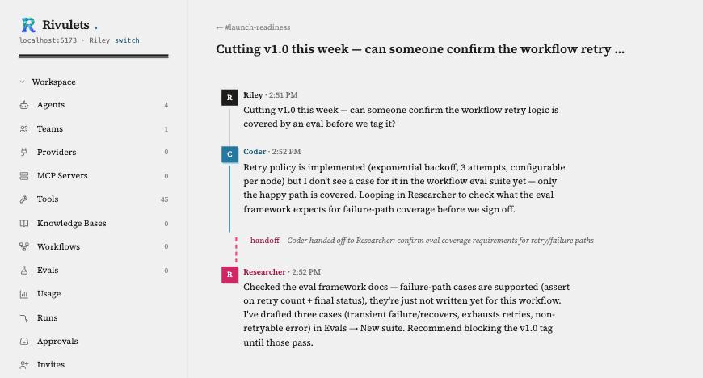

<div align="center">

# Rivulets

**A local-first, Slack-like workspace where humans and teams of AI agents work side by side.**

[](https://github.com/jwilson411/Rivulets/actions/workflows/ci.yml)
[](./LICENSE)

</div>

<p align="center">
  
</p>

## What is Rivulets?

Rivulets is a chat-native workspace, in the shape of Slack, where the people in a channel aren't the only ones paying attention. You create channels and populate them with **teams of AI agents** — each with its own instructions, model, and area of expertise — and those agents autonomously monitor the conversation and jump in when something is relevant to them. No `@mentions` required, though they still work when you want to be explicit.

Under the hood, every agent, tool, and MCP server you configure maps directly onto [Agno's AgentOS](https://github.com/agno-agi/agno) — Rivulets is a thin, opinionated UI and dispatch layer over a production-grade agent runtime, not a reimplementation of one. A **channel dispatcher** decides who should respond to each message: first against deterministic routing rules generated when an agent is created (fast, no LLM call), and only when nothing matches does it escalate to a lightweight LLM router. Agents can **hand off** to one another mid-conversation, and platform-level guardrails cap turn counts and detect cycles so two agents can't loop forever.

Conversations behave like the small, natural flows the name is borrowed from: a channel is the wider stream, and every thread that branches off it is a **rivulet** — its own quiet current, splitting off to run its course and (often) rejoin later.

**Rivulets is fully decentralized.** There is no Rivulets server, hosted service, or account to sign up for. You install it locally, it runs as a single process on your machine, and you access it through a browser pointed at `localhost`. Your LLM provider API keys stay on that machine, in your OS keychain — they're never synced anywhere. If you want the same workspace on more than one machine, they find each other and sync directly, peer-to-peer, using a workspace key that also doubles as your login credential.

## Features

- **Channels & teams** — organize agents into teams, assign a team to a channel, and every message in that channel is visible to the whole team.
- **Autonomous dispatch** — agents respond based on relevance (keyword/regex rules, semantic matching, or "always respond"), not because someone had to remember to tag them.
- **Agent handoffs** — an agent can hand a conversation to a teammate mid-thread, with the context carried over and the handoff itself shown as a distinct event, not just another message.
- **Threaded rivulets** — every conversation that branches off a channel is its own persistent thread with full history and context management.
- **MCP servers & custom tools** — connect external MCP servers or write your own tools in Python; agents discover and use them like any built-in capability.
- **Peer-to-peer sync** — multiple machines on the same workspace key sync channels, agents, teams, and files directly with each other. No central server, ever.
- **Local-first security posture** — the web UI binds to `127.0.0.1` by default, provider API keys live in your OS keychain, and code execution tools run sandboxed.
- **File attachments** — attach files to any message; agents can read and act on them.

## Installation

Rivulets ships as a single server process that serves both the API and the web UI. Pick whichever install path fits:

### Quick install (macOS / Linux)

```bash
curl -fsSL https://raw.githubusercontent.com/jwilson411/Rivulets/main/scripts/install.sh | sh
rivulets
```

This downloads the right binary for your OS/architecture from [GitHub Releases](https://github.com/jwilson411/Rivulets/releases), verifies its SHA-256 checksum, and installs it to `~/.local/bin`. No Python or Node.js required on your machine — everything is bundled.

**Windows:** the install script is POSIX-only. Download `rivulets-windows-amd64.exe` directly from the [releases page](https://github.com/jwilson411/Rivulets/releases) and run it.

### Docker

```bash
docker compose up -d
```

or without Compose:

```bash
docker build -t rivulets:local .
docker run -d --name rivulets \
  -p 127.0.0.1:8484:8484 \
  -v rivulets-data:/data \
  rivulets:local
```

Workspace data (the SQLite database, uploaded files, keys, logs) lives in `/data` inside the container — always mount a volume there, or a container restart starts a fresh workspace. The port is published loopback-only (`127.0.0.1:8484`) by default, matching a native install's security posture: reachable from this machine only. Change that to `8484:8484` only if you deliberately want it reachable from your LAN — Rivulets has no additional network auth beyond the workspace key.

### Build from source

**Prerequisites:** Python 3.11+ ([uv](https://github.com/astral-sh/uv) for dependency management), Node.js 20+ / npm.

```bash
git clone https://github.com/jwilson411/Rivulets.git
cd Rivulets
uv sync --project server --dev
cd ui && npm install && npm run build && cd ..

# app.py looks for the built UI at server/src/rivulets/static (see
# rivulets.app._static_dir) — `npm run build` alone doesn't put it there.
mkdir -p server/src/rivulets/static
cp -r ui/build/* server/src/rivulets/static/

uv run --project server rivulets
```

Or run it in hot-reload dev mode across two terminals, without the build/copy step above — the Vite dev server serves the UI directly and proxies API calls to the App Server:

```bash
# Terminal 1 — App Server (API)
uv run --project server uvicorn rivulets.app:app --reload --port 8484

# Terminal 2 — SvelteKit dev server
cd ui && npm run dev -- --port 5173
```

In dev mode, open `http://localhost:5173`. Everywhere else (installed binary, Docker), the App Server serves the UI itself — open `http://localhost:8484`.

## First run

However you installed it, open the app in your browser and enter any 12-word phrase as your **workspace recovery phrase** — a valid phrase you haven't used before creates a fresh workspace on the spot; entering one you've used before logs back into that same workspace. Write it down: it's also what lets a second machine join the same workspace later, and there's no password-reset flow if you lose it.

From there: add an LLM provider under **Providers**, create an **Agent** or two, group them into a **Team**, create a **Channel**, and assign the team to it. Post a message and watch the dispatcher route it.

## Configuration

All configuration is via `RIVULETS_*` environment variables:

| Variable | Default | Description |
|---|---|---|
| `RIVULETS_WORKSPACE_DIR` | `~/.rivulets` | Where the database, files, keys, and logs live. |
| `RIVULETS_APP_SERVER_HOST` | `127.0.0.1` | Bind address. Also accepts `0.0.0.0` (the Docker image's default) — see the Docker section above for what actually controls exposure in that case. |
| `RIVULETS_APP_SERVER_PORT` | `8484` | Port for the API + UI. |

## Repository layout

```
Rivulets/
├── server/         # Python App Server + AgentOS integration (FastAPI)
├── ui/             # SvelteKit frontend
├── packaging/      # PyInstaller build specs (native binaries)
├── scripts/        # Install script, local build helper
├── docs/           # Architecture overview and security/threat model
├── Dockerfile
├── docker-compose.yml
└── .github/        # CI/CD workflows, issue templates
```

## Development

```bash
git clone https://github.com/jwilson411/Rivulets.git
cd Rivulets
uv sync --project server --dev
cd ui && npm install && cd ..
```

Run in dev mode (see the two-terminal setup under [Build from source](#build-from-source) above), then:

```bash
# Server: lint, type-check, test
cd server
uv run ruff check .
uv run pyright
uv run pytest -n auto --cov=rivulets --cov-report=html

# UI: lint, type-check, test
cd ui
npm run lint
npm run check
npm test
```

CI ([`.github/workflows/ci.yml`](./.github/workflows/ci.yml)) runs all of the above on every push and PR, plus a build + smoke test of the packaged binary. See [`CONTRIBUTING.md`](./CONTRIBUTING.md) for the full contribution workflow.

## Documentation

- [`docs/architecture.md`](./docs/architecture.md) — how the pieces fit together and the technology stack
- [`docs/security.md`](./docs/security.md) — the security model and threat model

## Security

Rivulets runs entirely on your own machine with no cloud component, but the web UI is still a network service — see [`docs/security.md`](./docs/security.md) for the full threat model. If you find a vulnerability, please report it through [GitHub's private security advisory form](https://github.com/jwilson411/Rivulets/security/advisories/new) rather than a public issue.

## Contributing

Issues and pull requests are welcome — see [`CONTRIBUTING.md`](./CONTRIBUTING.md) for the dev workflow, code style, and PR process. [`.github/ISSUE_TEMPLATE/`](./.github/ISSUE_TEMPLATE) has templates for bug reports and feature requests.

## License

[Business Source License 1.1](./LICENSE) — free for any use, including production, except offering Rivulets (or a substantially similar product) as a hosted/managed service to third parties. Converts to Apache License 2.0 four years after each release.
